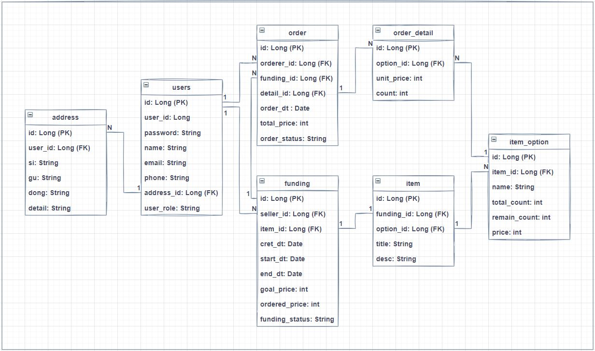

# Funding Project
######: 기한 내 목표 판매금액 도달 시 결제가 확정되는 펀딩상품 거래 플랫폼 API 서버

---
## <u>1. SPECIFICATION</u>
- Java 11
- Spring Boot
- Spring Data JPA
- Junit 5

---
## <u>2. USECASE</u>

### # 판매자 (SELLER)

- 펀딩 상품 등록/삭제
- 등록된 펀딩 리스트 및 상세정보 조회

### # 주문자 (ORDERER)

- 진행예정/진행중/진행완료 펀딩 상품 조회
- 펀딩 상품 구매
- 구매 내역 조회

### # 시스템 BATCH

- 펀딩 기간이 만료시 펀딩 상태 변경
- 펀딩 실패 시 결제 취소처리
- 

> 참고 ISSUE   
> SELLER- [#9](https://github.com/f-lab-edu/Funding/issues/9)   
> ORDERER- [#10](https://github.com/f-lab-edu/Funding/issues/10)   
> BATCH- [...]()

---
## <u>3. ARCHITECTURE</u>

---
## <u>4. DB SCHEMA</u>

---
## <u>5. ETC</u>